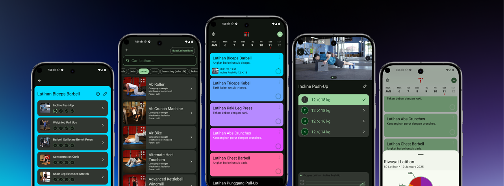

### Tabiat

Gym Tracker with more than 800 exercise template and you can create your own custom exercise. Available on Android and iOS.

Exercise source from [Github Repo](https://raw.githubusercontent.com/anwar-pasaribu/free-exercise-db/main/dist/exercises.json)

#### Tech Stacks
| Feature | Tech |
| ----------- | ----------- |
| Multiplatform UI |[Compose Multiplatform](https://www.jetbrains.com/compose-multiplatform/)|
| Dependency Injection |[Koin](https://insert-koin.io/)|
| Storage | [SQLDelight](https://sqldelight.github.io/sqldelight/2.0.2/multiplatform_sqlite/), [Android Jetpack DataStore](https://developer.android.com/topic/libraries/architecture/datastore) |
|Chart|[Chart](https://github.com/TheChance101/AAY-chart)|
|Pipeline|[CircleCI](https://circleci.com/) (for CI/CD), [Fastlane](https://fastlane.tools/) (auto publish to Play Store)
|App Analytics|[Firebase](https://firebase.google.com/)|
|Image Loader|[Coil](https://coil-kt.github.io/coil/) (multiplatform image loader)|
|Network|[Ktor Client](https://ktor.io/docs/client-create-new-application.html)|